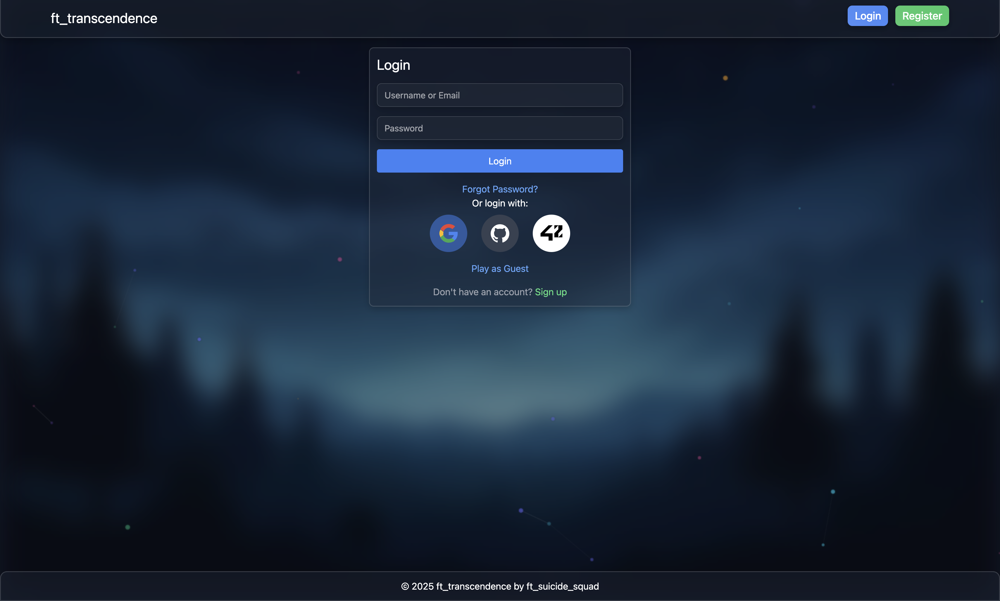
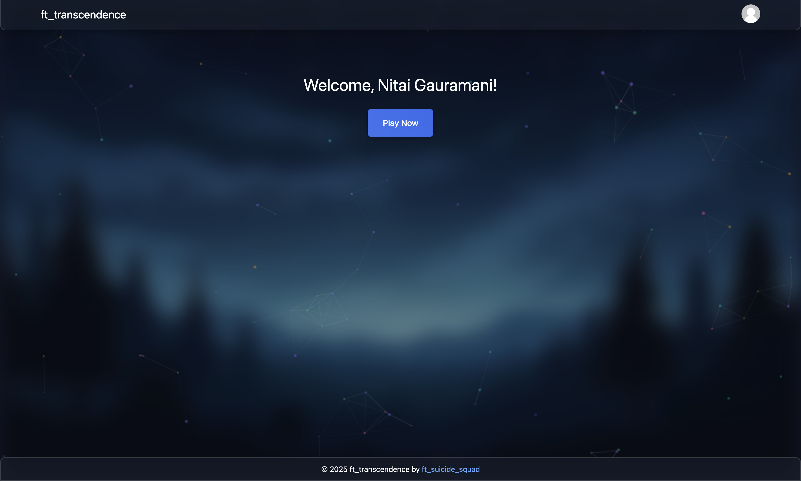
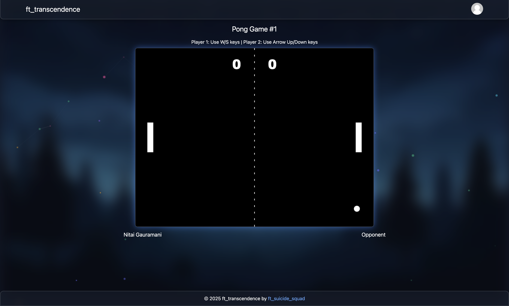
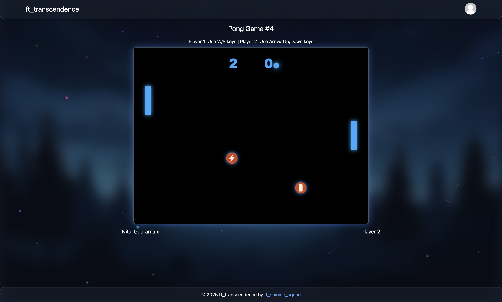
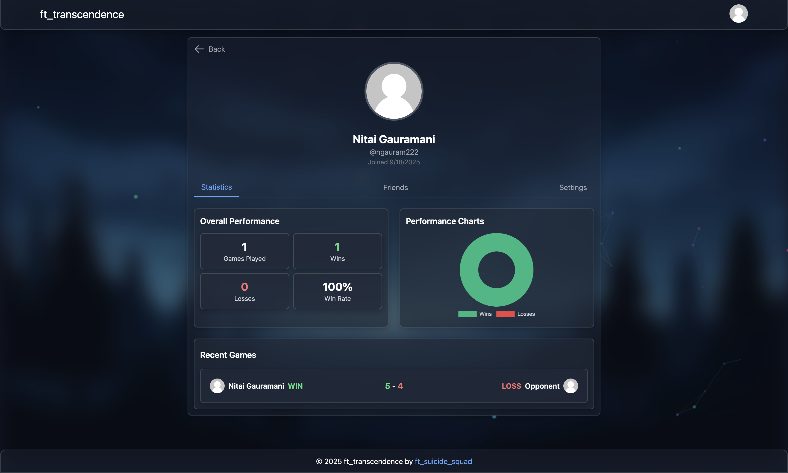
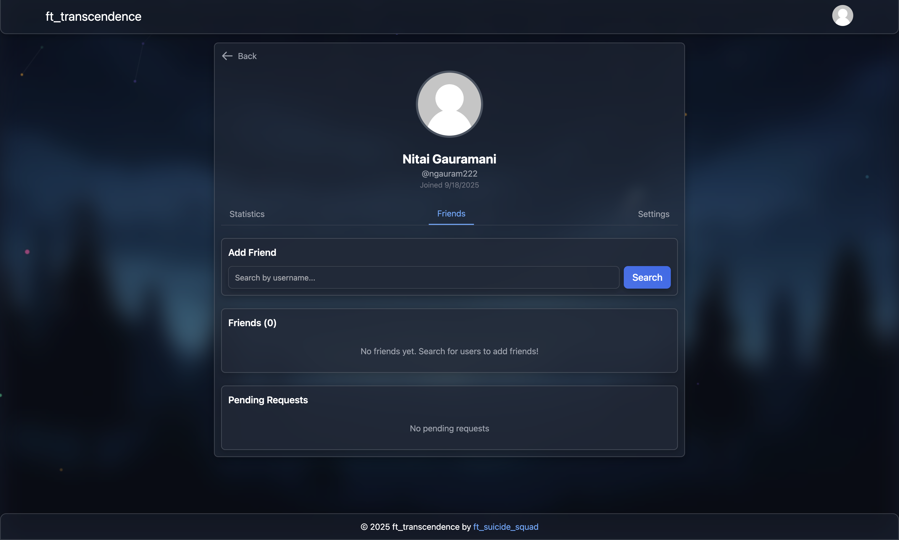
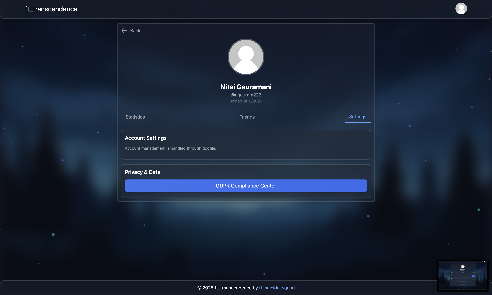

# ft_transcendence

A full-stack single page web application featuring real-time Pong gameplay, tournaments, and social features built for the 42 School curriculum. This project demonstrates modern web development practices with microservices architecture, real-time communication, and comprehensive security measures.

---

## Features
### Core Gameplay
+ Real-time Pong: Classic Pong gameplay with smooth physics and responsive controls
+ Tournament System: Multi-player tournaments with bracket visualization
+ Remote/Online Multiplayer: Play against other users on different devices
+ Local Multiplayer: Two players on the same device

### User Management
+ User Registration & Authentication: Secure signup/login with email verification
+ OAuth Integration: Google, GitHub, and 42 intranet authentication
+ Profile Management: Custom avatars, display names, and user statistics
+ Friend System: Add friends, view online status, and send game invitations

### Social Features
+ Friend System: Social connections and status tracking
+ Game Invitations: Send and receive game invites through chat
+ Stats: Detailed stats for each game, as well as graphs and overall stats

### Security & Compliance
+ JWT Authentication: Secure token-based authentication
+ Two-Factor Authentication: Optional 2FA for enhanced security
+ HashiCorp Vault: Secure secrets management
+ GDPR Compliance: User data management and deletion options
+ WAF/ModSecurity: Web application firewall protection
+ HTTPS Everywhere: All traffic encrypted with SSL including internal
+ Password Hashing: bcrypt with configurable rounds
+ Rate Limiting: API request rate limiting
+ CSP Headers: Content Security Policy protection
+ XSS Protection: Input sanitization and output encoding
+ SQL Injection Prevention: Parameterized queries

### Technical Infrastructure
+ Microservices Architecture: Independently scalable services
+ Docker Containers: Containerized deployment
+ API Gateway: Unified API endpoint with request routing
+ Real-time WebSockets: Live game updates and notifications
---

## Project Structure

```
transcendence/
├── docker-compose.yml          # Multi-container setup
├── Makefile                    # Development commands
├── .env.example                # Environment configuration template
├── frontend/                   # TypeScript + Tailwind frontend
│   └── src/
│       ├── pages/              # Application pages
│       ├── services/           # API communication
│       └── utils/              # Utilities and types
├── services/                   # Backend microservices
│   ├── api-gateway/            # Unified API endpoint
│   ├── auth-service/           # Authentication & user management
│   ├── pong-service/           # Game logic and WebSockets
│   └── social-service/         # Chat and social features
├── nginx/                      # Reverse proxy with SSL
│   ├── certs/                  # SSL certificates
│   └── confs/                  # Nginx configuration
├── database/                   # SQLite database setup
└── vault/                      # Secrets management
    ├── config/                 # Vault policies
    └── scripts/                # Initialization scripts
```
---

## Installation

### Prerequisites
+ Docker and Docker Compose
+ Node.js 18+ (for development)

### Quick Start
+ Clone the repository
  ```bash
  git clone https://github.com/ngaurama/transcendence.git
  cd transcendence
  ```
+ Set up environment configuration
  ```bash
  cp .env.example .env
  # Edit .env with your configuration (see Configuration section below)
  ```
+ Start the application
  ```bash
  make up
  ```

### Access the application
+ Frontend: https://localhost:8443 or at https://LAN_IP:8443
---
### Configuration
+ You can change the current Self-signed certificates with your own located at `nginx/certs`

+ Edit the .env file with your specific configuration (please make sure you gitignore your .env):

  #### SMTP Email Service (for verification and forgot password emails)
  ```bash
  SMTP_HOST=smtp.gmail.com
  SMTP_PORT=465
  SMTP_EMAIL=your.email@gmail.com
  SMTP_PASSWORD=your-app-password
  ```
  #### OAuth Providers
  Currently the code is only configured such that the host device with localhost url can use oauth. <br>
  You can change that in the frontend, but you would have to add the lan_ip redirect uri to the oauth services
  + Google OAuth:
    + Create project at Google Cloud Console
    + Enable Google API
    + Create OAuth 2.0 credentials
    + Add authorized redirect URIs
      ```bash
      GOOGLE_CLIENT_ID=your_google_client_id
      GOOGLE_CLIENT_SECRET=your_google_client_secret
      GOOGLE_REDIRECT_URI=https://localhost:8443/auth/callback
      ```

  + GitHub OAuth:
    + Create OAuth App at GitHub Developer Settings
    + Set authorization callback URL
      ```bash
      GITHUB_CLIENT_ID=your_github_client_id
      GITHUB_CLIENT_SECRET=your_github_client_secret
      GITHUB_REDIRECT_URI=https://localhost:8443/auth/callback
      ```

  + 42 Intranet OAuth (for both oauth and credits page):
    + Create app at 42 Intra OAuth
    + Set redirect URI
      ```bash
      FORTYTWO_CLIENT_ID=your_42_client_id
      FORTYTWO_CLIENT_SECRET=your_42_client_secret
      FORTYTWO_REDIRECT_URI=https://localhost:8443/auth/callback
      ```
---

## Modules Implemented:
Major Modules (8/16)
+ ✅ Web - Backend Framework (Fastify + Node.js)
+ ✅ User Management - Standard Authentication & Accounts
+ ✅ User Management - Remote Authentication (Google/GitHub/42)
+ ✅ Gameplay - Remote Players
+ ✅ Cybersecurity - WAF/ModSecurity + Vault
+ ✅ Cybersecurity - 2FA + JWT
+ ✅ DevOps - Microservices Backend
+ ✅ Server-Side Pong - API & Server-side Logic

Minor Modules (6/11)
+ ✅ Web - Frontend Framework/Toolkit (TypeScript + Tailwind)
+ ✅ Web - Database (SQLite)
+ ✅ Gameplay - Game Customization Options
+ ✅ AI - Stats Dashboards
+ ✅ Cybersecurity - GDPR Compliance & Data Management
+ ✅ Accessibility - Expanding Browser Compatibility

---
## Screenshots
### Login Page
  
### Homepage
  
### Game selection
  
### Classic Gameplay
  
### Neon Board with powerups enabled gameplay
  
### Dashboard -> Stats
  
### Dashboard -> Friends
  
### Dashboard -> Settings
  
### Credits Pagse
  

--- 
## Team
ft_suicide_squad - 42 Paris Common Core
+ Nitai Gauramani (ngaurama)
+ Abdelhak Boudjelida (abboudje)
+ Ilyana Megy (ilymegy)
+ Olga Prosviriakova (oprosvir)
+ Mohamed Emine Acheuk-Youcef (macheuk-)

## Author
+ Nitai Gauramani
  - 42 Paris – Common Core project <br>


